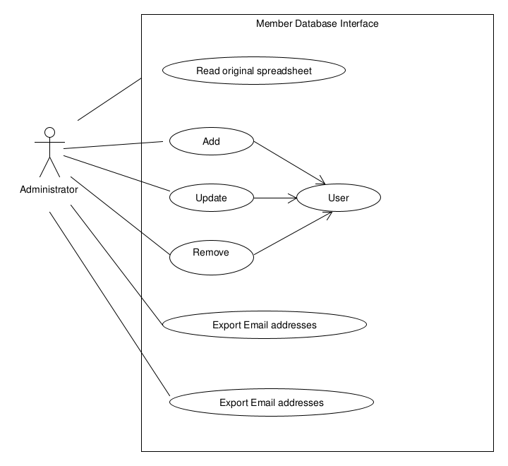
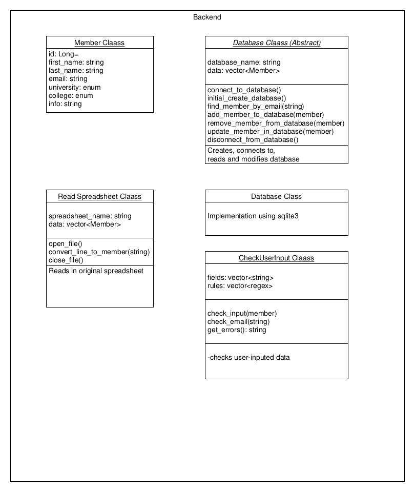

# member-database
A program to read spreadsheet data of society members and convert it to a database. The program is being built using test driven development. First requirements are sketched. Next a class diagram is created. Tests are created BEFORE each class implementation is written. 

## Requirements

An administrator must be able to read the original spreadsheet, add, modify and delete member records, and export the member list, either as a spreadsheet, or as a list of emails.

## Class diagram
 is a summary of the planned backend classes. See [documentation](documentation/html) for all actual classes.
